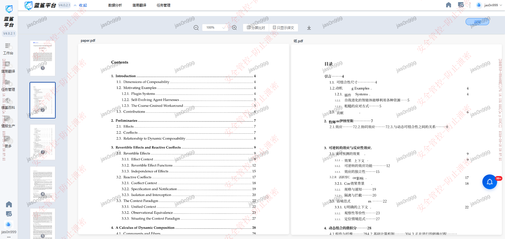

> 历史归档：这是项目更名前遗留的日报说明，仅用于追溯。当前模板请使用
> [`docs/daily-report-template.md`](../daily-report-template.md)。

# 蓝鲨项目日报生成

根据本次会话中对 `bluesharks_auto/` 项目的代码改动，生成日报。

## 日报格式

```
【任务一】蓝鲨自动化测试开发

具体进展：{百分比}%，今日优化内容如下：

1.{要点一}
2.{要点二}
...
```

## 要求

- 只记录有实际价值的改动（模块重构、算法优化、新功能），不写琐碎的参数调整、日志格式修改
- 每条用一句话描述，不用解释细节
- 具体进展百分比基于上次日报（初始 30%）适当递增，单日增幅 5~10%
- 如果本会话没有实质性代码改动，直接说"本日无实质性代码变更"

